# everychat

**Search every AI conversation you've ever had.** ChatGPT, Claude, Gemini, Claude Code and Codex, in one local index. Free, offline, and your coding agent can query it over MCP.

[](https://pypi.org/project/everychat/)
[](https://github.com/WayneLY-Chen/everychat/actions/workflows/ci.yml)
[](https://pypi.org/project/everychat/)
[](LICENSE)

<p align="center">
  
</p>

You have asked an AI the same question three times across three products. everychat makes the first answer findable, and lets your agent find it too.

```bash
uv tool install everychat
everychat sync                                   # index Claude Code + Codex sessions on this machine
everychat import ~/Downloads/chatgpt-export.zip  # add your ChatGPT / Claude.ai / Gemini exports
everychat search "timezone bug"
claude mcp add everychat -- everychat mcp        # give Claude Code access to all of it
```

## Why

- Chat history is split across vendors, and the built-in search in each one is weak or missing.
- Coding agents (Claude Code, Codex) keep sessions on disk in formats nobody reads.
- Your next conversation would be better if the model could see what you decided last month.

## What you get

- **One command to index local agent sessions.** `everychat sync` finds Claude Code and Codex logs on your machine.
- **Import vendor exports.** Drop in the zip or JSON from ChatGPT, Claude.ai, or Google Takeout (Gemini).
- **Fast substring search in any language.** SQLite FTS5 with trigram tokens, so Chinese, Japanese and code identifiers work without a word segmenter.
- **MCP server.** Add it to Claude Code, Codex, Cursor or any MCP client. Ask "did I already solve this?" and the agent looks it up.
- **Optional semantic search**, fully local, no API key.
- **No cloud.** One SQLite file in `~/.everychat`. Nothing is uploaded anywhere.

## Install

```bash
uv tool install everychat          # or: pipx install everychat   /   pip install everychat
```

Python 3.10 or newer. Nothing else.

## Use

```bash
everychat sync                                  # index Claude Code + Codex sessions on this machine
everychat import ~/Downloads/chatgpt-export.zip # ChatGPT data export (zip or conversations.json)
everychat import ~/Downloads/claude-export.zip  # Claude.ai data export
everychat import ~/Takeout/My\ Activity/Gemini\ Apps/MyActivity.json

everychat search "rate limiter"                 # search everything
everychat search "寫一個" --source claude-code  # filter by source
everychat show 412                              # print one conversation
everychat recent --limit 10
everychat stats
```

Run `everychat sync` again any time. Unchanged files are skipped.

### Give your coding agent a memory

```bash
claude mcp add everychat -- everychat mcp        # Claude Code
```

For Codex, Cursor or any other MCP client, register a stdio server with the command `everychat mcp`. The server exposes four tools: `search_chats`, `get_chat`, `recent_chats`, `list_sources`.

Then, in a new session:

> "I set up a Postgres connection pool for this project a few weeks ago. Find how I configured it."

The agent calls `search_chats`, reads the old conversation with `get_chat`, and continues from there.

### Semantic search (optional)

```bash
uv tool install "everychat[semantic]"
everychat embed                      # one-off, runs a small multilingual model on CPU
everychat search --semantic "that time the deploy broke because of timezones"
```

The model is `paraphrase-multilingual-MiniLM-L12-v2` via fastembed. It is downloaded once (about 120 MB) and never phones home.

## Where to get your exports

| Source | How |
|---|---|
| ChatGPT | Settings → Data controls → Export data. You get a zip with `conversations.json`. |
| Claude.ai | Settings → Privacy → Export data. You get a zip with `conversations.json`. |
| Gemini | [Google Takeout](https://takeout.google.com) → My Activity → choose **JSON** format → Gemini Apps → `MyActivity.json`. |
| Claude Code | Nothing to do. `everychat sync` reads `~/.claude/projects`. |
| Codex | Nothing to do. `everychat sync` reads `~/.codex/sessions`. |

Gemini's Takeout does not group turns into conversations, so each prompt and its reply become a two-message conversation.

## How it works

```
exports / session logs  →  importers  →  SQLite (conversations, messages, FTS5 trigram index)
                                               ↑                      ↓
                                      everychat embed          everychat search / mcp
```

- Importers normalise each format to `Conversation(source, external_id, title, messages[])`. Re-importing the same conversation replaces it; nothing is duplicated.
- For ChatGPT, only the branch you last viewed is kept (the export stores every regenerated branch).
- For Claude Code and Codex, only human and assistant text is indexed. Tool calls, tool output, thinking blocks, subagent threads and injected context (`<system-reminder>`, `<app-context>`, AGENTS.md instructions) are stripped.
- Search collapses to the best hit per conversation. Queries under three characters use `LIKE` because the trigram tokenizer needs three.

Set `EVERYCHAT_HOME` to move the database. `CLAUDE_CONFIG_DIR` and `CODEX_HOME` are honoured.

## Roadmap

- [ ] Cursor, Gemini CLI, OpenCode, Aider session importers
- [ ] Watch mode: re-index when a session file changes
- [ ] Tiny local web UI
- [ ] Export search results as Markdown for pasting into a new chat

Contributions for new importers are very welcome. An importer is one file with `detect()` and `parse()`; see [`src/everychat/importers/claude_web.py`](src/everychat/importers/claude_web.py) for the shortest example.

## Privacy

Everything stays on your machine. The database is a plain SQLite file; delete it and it's gone. The MCP server only answers the client you attach it to.

## License

MIT

---

## 中文說明

**把你所有 AI 對話變成可搜尋的記憶。** ChatGPT、Claude、Gemini、Claude Code、Codex 全部進同一個本地索引，免費、離線，而且你的 coding agent 可以透過 MCP 查詢它。

```bash
uv tool install everychat
everychat sync                        # 自動索引本機的 Claude Code 與 Codex 對話
everychat import chatgpt-export.zip   # 匯入 ChatGPT / Claude.ai 匯出檔
everychat search "上次那個 timezone 的 bug"
claude mcp add everychat -- everychat mcp   # 讓 Claude Code 能查你的歷史
```

中文搜尋直接可用，不需要斷詞。所有資料都留在 `~/.everychat`，不會上傳到任何地方。
